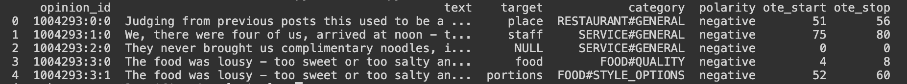

# TextClassification
A pipeline for aspect-based sentiment classification, mining and summarizing opinions from text about specific entities and their aspects.
Text input -> seq2seq IOB tagging -> pre-trained embedding vectors -> LSTM

Data Engineering:
  Text cleaning, contraction expansion, lemmatization
End to end modelling and inferencing pipeline:
  Convert text sequence into embedding vectors
  Create PoS tags
  Sequence to sequence IOB2 tagging for OTE(opinion-term-expressions) identification

Example input:
"Service was terribly slow and the restaurant was noisy, but the waiter was friendly and the calamari was very delicious."
Example output:
(OTE target words, entity:aspect, polarity)
("service", SERVICE:GENERAL, negative)
("restaurant", AMBIENCE:GENERAL, negative)
("waiter", SERVICE:GENERAL, positive)
("calamari", FOOD:QUALITY, positive)

All data files found at http://alt.qcri.org/semeval2016/task5/.

## Background
Aim at understanding specific sentiment torwards different aspects of an entity. 

## Pipeline
Step 1: Identify OTE(Opinion Target Expression)
Use a CNN with time-distributed dense layer at the output to perform seq-2-seq IOB2 tagging. 
Input: padded tokenized word sequences + pretrained embedding matrix
Output: IOB2 tags identifying the sequence location of the OTEs
Step 2: Identify entity:aspect pair and the sentiment polarity within each review sentence
USE LSTM stacked on top of a CNN. 
Input: tokenized word sequences + pretrained embedding matrix, POS tags, IOB2 tags
Output: aspect and polarity associating with a particular OTE 

## Data engineering
After preprocessing, turn raw xml data into dataframe, it looks like:

